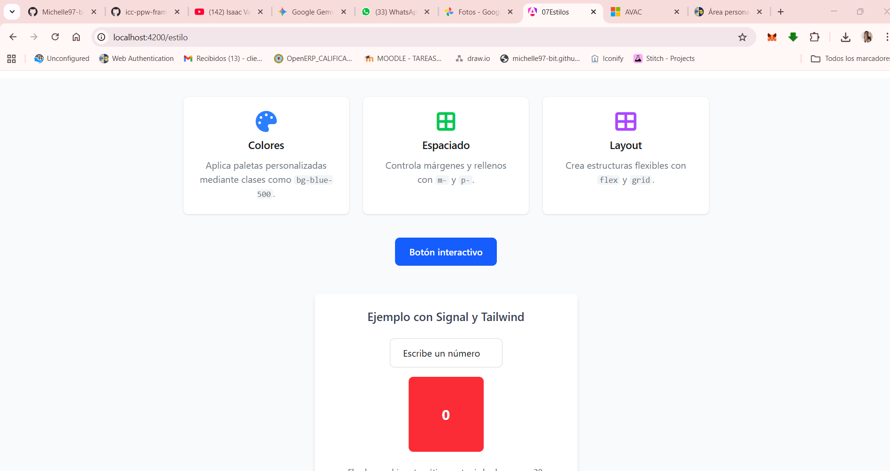
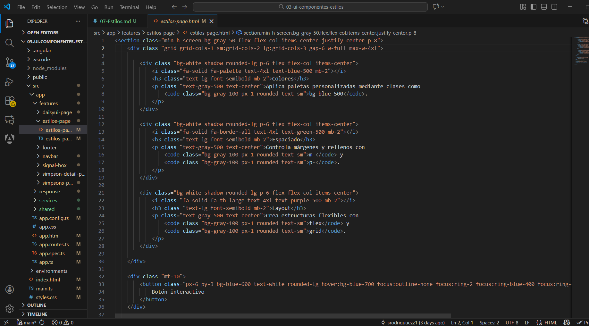

# Programación y Plataformas Web

## Frameworks Web: Angular + TailwindCSS

<div align="center">
  
  <span style="font-size: 80px; color: black; margin: 20px 20px;">+</span>
  
</div>

## Práctica 7: Estilos con TailwindCSS

### Autor

**Pablo Torres**
📧 [ptorresp@ups.edu.ec](mailto:ptorresp@ups.edu.ec)
💻 GitHub: [PabloT18](https://github.com/PabloT18)

---

# Introducción a los estilos con TailwindCSS

**TailwindCSS** es un framework de utilidades CSS que permite aplicar estilos directamente desde el HTML mediante clases pequeñas y descriptivas.
Cada clase controla una sola propiedad de estilo, lo que permite **crear componentes visuales sin escribir archivos CSS personalizados**.

Este enfoque ofrece coherencia, rapidez y control total sobre la apariencia de la aplicación, especialmente en proyectos **Angular 20+**.

---

## 1. Funcionamiento de las utilidades y breakpoints

### 1.1. Utilidades base

| Categoría   | Ejemplo                                       | Descripción                                                                        |
| ----------- | --------------------------------------------- | ---------------------------------------------------------------------------------- |
| Margen      | `m-4`, `mt-2`, `mx-6`                         | Márgenes: `m` = todos, `t` = top, `b` = bottom, `x` = left+right, `y` = top+bottom |
| Padding     | `p-4`, `py-2`, `px-6`                         | Relleno interior                                                                   |
| Texto       | `text-sm`, `text-xl`, `font-bold`             | Tamaño y peso del texto                                                            |
| Fondo       | `bg-blue-500`, `bg-gray-100`                  | Color de fondo                                                                     |
| Bordes      | `border`, `border-2`, `rounded-lg`            | Grosor de borde y esquinas redondeadas                                             |
| Display     | `flex`, `grid`, `block`                       | Tipo de contenedor                                                                 |
| Flexbox     | `flex-col`, `justify-between`, `items-center` | Dirección y alineación de elementos                                                |
| Grid        | `grid-cols-3`, `gap-4`                        | Configuración de columnas y separación                                             |
| Dimensiones | `w-full`, `w-1/2`, `h-32`                     | Control del ancho y alto                                                           |

---

### 1.2. Breakpoints y diseño responsivo

Los **breakpoints** permiten aplicar estilos específicos según el tamaño de la pantalla.

| Prefijo | Min width | Uso típico        |
| ------- | --------- | ----------------- |
| `sm:`   | 640px     | móviles grandes   |
| `md:`   | 768px     | tablets           |
| `lg:`   | 1024px    | laptops pequeñas  |
| `xl:`   | 1280px    | pantallas grandes |
| `2xl:`  | 1536px    | monitores grandes |

Ejemplo:

```html
<div class="text-sm md:text-base lg:text-xl p-2 md:p-6">
  Texto que cambia según el tamaño de pantalla.
</div>
```

Interpretación:

* En móviles: `text-sm p-2`
* En tablets (md): `text-base p-6`
* En laptops (lg): `text-xl`

---

## 2. Orden recomendado al escribir clases Tailwind

Aunque Tailwind no exige un orden, una estructura coherente facilita la lectura y mantenimiento del código:

1. **Layout:** display, position, spacing
2. **Box model:** padding, margin, width, height
3. **Tipografía:** texto, color, peso, alineación
4. **Decoración:** fondo, bordes, sombras
5. **Estados:** hover, focus, active
6. **Breakpoints:** sm:, md:, lg:, xl:

Ejemplo:

```html
<div class="flex items-center justify-between p-4 mb-3 text-lg font-semibold bg-gray-100 border rounded-lg hover:bg-gray-200 md:text-xl">
```

---

## 3. Utilidades más comunes y recomendadas

### 3.1. Espaciados

| Utilidad         | Ejemplo                | Descripción           |
| ---------------- | ---------------------- | --------------------- |
| Margin           | `m-0` a `m-96`         | Márgenes exteriores   |
| Padding          | `p-0` a `p-96`         | Relleno interior      |
| Ejes específicos | `mt-4`, `px-6`, `py-2` | Control por dirección |

### 3.2. Tipografía

| Utilidad   | Ejemplo                           | Uso                                 |
| ---------- | --------------------------------- | ----------------------------------- |
| Tamaño     | `text-xs`, `text-3xl`             | Escala tipográfica                  |
| Peso       | `font-light`, `font-bold`         | Grosor de texto                     |
| Color      | `text-gray-700`, `text-red-500`   | Color del texto                     |
| Alineación | `text-center`, `text-left`        | Posición horizontal                 |
| Espaciado  | `leading-normal`, `tracking-wide` | Interlineado y espacio entre letras |

### 3.3. Fondo, sombras y bordes

| Utilidad   | Ejemplo                                       | Uso                |
| ---------- | --------------------------------------------- | ------------------ |
| Fondo      | `bg-blue-500`                                 | Color de fondo     |
| Gradientes | `bg-gradient-to-r from-blue-500 to-green-500` | Degradado          |
| Bordes     | `border`, `border-2`, `border-gray-300`       | Grosor y color     |
| Curvatura  | `rounded`, `rounded-lg`, `rounded-full`       | Bordes redondeados |
| Sombra     | `shadow`, `shadow-lg`, `shadow-xl`            | Sombras elevadas   |

### 3.4. Display y posicionamiento

| Utilidad | Ejemplo                                 | Uso                      |
| -------- | --------------------------------------- | ------------------------ |
| Display  | `block`, `inline-block`, `flex`, `grid` | Tipo de caja             |
| Posición | `relative`, `absolute`, `fixed`         | Posicionamiento          |
| Flexbox  | `justify-center`, `items-start`         | Alineación en ejes       |
| Grid     | `grid-cols-2`, `col-span-3`             | Organización en columnas |

### 3.5. Dimensiones

| Utilidad | Ejemplo                      | Descripción        |
| -------- | ---------------------------- | ------------------ |
| Ancho    | `w-full`, `w-1/2`, `w-96`    | Control horizontal |
| Alto     | `h-full`, `h-screen`, `h-48` | Control vertical   |
| Min/Max  | `min-w-0`, `max-w-xl`        | Límites            |

---

## 4. Utilidades esenciales para todo proyecto

**Layout general**

```html
<div class="container mx-auto px-4"></div>
<div class="flex items-center justify-between"></div>
<div class="grid grid-cols-1 sm:grid-cols-2 lg:grid-cols-4 gap-4"></div>
```

**Tarjetas y componentes**

```html
<div class="p-4 bg-white shadow rounded-lg hover:shadow-lg transition"></div>
```

**Botones**

```html
<button class="px-4 py-2 bg-blue-600 text-white font-semibold rounded hover:bg-blue-700 transition">
  Guardar
</button>
```

**Formularios**

```html
<input class="border p-2 rounded w-full focus:outline-none focus:ring-2 focus:ring-blue-500">
```

**Páginas completas**

```html
<section class="min-h-screen flex flex-col items-center justify-center"></section>
```

---

# PARTE PRÁCTICA

A continuación se pondrán en práctica las clases vistas, aplicándolas en una interfaz de ejemplo.

---

## PASO 1. Crear un nuevo componente

Dentro del proyecto Angular configurado con Tailwind, crear un componente de demostración:

```bash
ng g c features/estilos-page --standalone --skip-tests
```

### Código del componente

```typescript
import { ChangeDetectionStrategy, Component } from '@angular/core';

@Component({
  selector: 'app-estilos-page',
  standalone: true,
  templateUrl: './estilos-page.html',
  changeDetection: ChangeDetectionStrategy.OnPush,
})
export class EstilosPage {}
```

---

## PASO 2. Aplicar clases básicas

Crear el archivo `estilos-page.html` y agregar:

```html
<section>

    <h1>
        TailwindCSS en acción
    </h1>

    <p>
        Este ejemplo demuestra cómo aplicar márgenes, colores, tamaños de texto y espaciado
        con utilidades de Tailwind.
    </p>

    <div>

        <div>
            <i></i>
            <h3>Colores</h3>
            <p>Aplica paletas personalizadas mediante clases como
                <code>bg-blue-500</code>.
            </p>
        </div>

        <div>
            <i></i>
            <h3>Espaciado</h3>
            <p>Controla márgenes y rellenos con <code>m-</code> y <code>p-</code>.</p>
        </div>

        <div>
            <i></i>
            <h3>Layout</h3>
            <p>Crea estructuras flexibles con <code>flex</code> y <code>grid</code>.
            </p>
        </div>

    </div>


    <div>
        <button>
            Botón interactivo
        </button>
    </div>
</section>
```

### 2.1 Seccion
Esa línea corresponde a una **etiqueta `<section>`** con varias **clases de TailwindCSS** aplicadas.
Cada clase define una propiedad de estilo concreta. Vamos a descomponerla paso a paso:

```html
<section class="min-h-screen bg-gray-50 flex flex-col items-center justify-center p-8">
```

---

#### 1. `min-h-screen`

* **Significado:** establece que la sección tenga una altura mínima igual al **100 % del alto visible de la pantalla**.
* **Equivale en CSS a:**

  ```css
  min-height: 100vh;
  ```
* **Propósito:** hace que el contenedor ocupe al menos todo el alto del viewport, útil para centrar contenido verticalmente o crear secciones de página completas.

---

#### 2. `bg-gray-50`

* **Significado:** asigna un color de fondo gris muy claro (nivel 50 de la escala de grises de Tailwind).
* **Equivale en CSS a:**

  ```css
  background-color: #f9fafb; /* tono de gris claro */
  ```
* **Propósito:** crear contraste suave respecto a otros elementos, manteniendo una apariencia limpia.

---

#### 3. `flex`

* **Significado:** convierte el elemento en un **contenedor flexible (Flexbox)**.
* **Equivale en CSS a:**

  ```css
  display: flex;
  ```

---

#### 4. `flex-col`

* **Significado:** indica que los elementos hijos se organizarán en **columna**, uno debajo del otro.
* **Equivale en CSS a:**

  ```css
  flex-direction: column;
  ```

---

#### 5. `items-center`

* **Significado:** alinea los elementos hijos en el **eje transversal** (horizontal, porque la dirección es `column`) en el **centro**.
* **Equivale en CSS a:**

  ```css
  align-items: center;
  ```

---

#### 6. `justify-center`

* **Significado:** centra los elementos hijos en el **eje principal** (vertical, porque el contenedor usa `flex-col`).
* **Equivale en CSS a:**

  ```css
  justify-content: center;
  ```

---

#### 7. `p-8`

* **Significado:** aplica un **padding (relleno interno)** uniforme en todos los lados.
* En Tailwind, cada número equivale a un múltiplo de 0.25rem (4 px por unidad).
  Por tanto:
  `p-8` = 8 × 4 px = **32 px de relleno interno**.
* **Equivale en CSS a:**

  ```css
  padding: 2rem; /* 32px */
  ```

---

#### Resultado general


* Ocupa toda la pantalla verticalmente.
* Tiene fondo gris claro.
* Centra su contenido **horizontal y verticalmente**.
* Aplica un margen interior uniforme de 32 px.


```html
<section class="min-h-screen bg-gray-50 flex flex-col items-center justify-center p-8">
......
</section>


```
### 2.2 Div Contenedor 
```html
  <div class="grid grid-cols-1 sm:grid-cols-2 lg:grid-cols-3 gap-6 w-full max-w-4xl">
```

| Clase            | Función                                              | Descripción                                                                                                                         | Equivalente CSS aproximado                                                         |
| ---------------- | ---------------------------------------------------- | ----------------------------------------------------------------------------------------------------------------------------------- | ---------------------------------------------------------------------------------- |
| `grid`           | Activa el sistema de cuadrícula                      | Convierte el contenedor en un **Grid Layout**, lo que permite organizar los elementos hijos en filas y columnas.                    | `display: grid;`                                                                   |
| `grid-cols-1`    | Define el número de columnas base                    | Crea una cuadrícula con **1 columna** en el diseño base (móvil). Todos los elementos se apilan verticalmente.                       | `grid-template-columns: repeat(1, minmax(0, 1fr));`                                |
| `sm:grid-cols-2` | Versión responsive para pantallas pequeñas (≥ 640px) | A partir del breakpoint `sm`, la cuadrícula muestra **2 columnas**.                                                                 | `@media (min-width: 640px) { grid-template-columns: repeat(2, minmax(0, 1fr)); }`  |
| `lg:grid-cols-3` | Versión responsive para pantallas grandes (≥ 1024px) | A partir del breakpoint `lg`, la cuadrícula muestra **3 columnas**.                                                                 | `@media (min-width: 1024px) { grid-template-columns: repeat(3, minmax(0, 1fr)); }` |
| `gap-6`          | Espaciado entre celdas                               | Aplica un espacio uniforme de **1.5rem (24px)** entre filas y columnas.                                                             | `gap: 1.5rem;`                                                                     |
| `w-full`         | Ancho completo                                       | Hace que el contenedor ocupe **todo el ancho disponible** dentro de su elemento padre.                                              | `width: 100%;`                                                                     |
| `max-w-4xl`      | Limita el ancho máximo                               | Restringe el ancho máximo del contenedor a **64rem (1024px)** para mantener una apariencia centrada y legible en pantallas grandes. | `max-width: 64rem;`                                                                |

### 2.3 Card

```html
 <div class="bg-white shadow rounded-lg p-6 flex flex-col items-center">
      <i class="fa-solid fa-border-all text-4xl text-green-500 mb-2"></i>
      <h3 class="text-lg font-semibold mb-2">Espaciado</h3>
      <p class="text-gray-500 text-center">Controla márgenes y rellenos con <code>m-</code> y <code>p-</code>.</p>
    </div>
```
| Elemento / Clase                                        | Función principal              | Descripción breve                                                                                                                 |
| ------------------------------------------------------- | ------------------------------ | --------------------------------------------------------------------------------------------------------------------------------- |
| `div.bg-white`                                          | Fondo blanco                   | Crea contraste con el fondo general y da sensación de tarjeta limpia.                                                             |
| `shadow`                                                | Sombra sutil                   | Genera profundidad visual (efecto de elevación).                                                                                  |
| `rounded-lg`                                            | Bordes redondeados             | Suaviza las esquinas del contenedor.                                                                                              |
| `p-6`                                                   | Relleno interno                | Aplica 1.5 rem (24 px) de padding alrededor del contenido.                                                                        |
| `flex flex-col items-center`                            | Organización vertical centrada | Usa **Flexbox** para alinear los elementos (ícono, título, texto) en columna y centrarlos.                                        |
| `i.fa-solid.fa-border-all.text-4xl.text-green-500.mb-2` | Ícono decorativo               | Ícono de FontAwesome de tamaño grande (`text-4xl` ≈ 2.25 rem), color verde (`text-green-500`) y margen inferior pequeño (`mb-2`). |
| `h3.text-lg.font-semibold.mb-2`                         | Título del bloque              | Texto mediano, negrita y con espacio inferior para separar del párrafo.                                                           |
| `p.text-gray-500.text-center`                           | Texto descriptivo              | Texto gris claro, centrado, explicando el propósito de la tarjeta.                                                                |


#### Explicación

* Se usa una estructura con `grid` y `flex` para distribuir tarjetas.
* Cada tarjeta aplica clases de **espaciado**, **tipografía**, **sombra** y **bordes redondeados**.
* Los íconos usan FontAwesome, agregados desde CDN.

---

## PASO 3. Adaptar con breakpoints

Añadir clases responsivas para adaptar el diseño a distintos tamaños:

```html
<div class="grid grid-cols-1 sm:grid-cols-2 lg:grid-cols-3 gap-6">
```

Esto garantiza:

* 1 columna en móviles
* 2 en pantallas medianas
* 3 en pantallas grandes

También se pueden escalar textos:

```html
<h1 class="text-2xl md:text-3xl lg:text-4xl font-bold text-gray-800 mb-4">
  TailwindCSS Responsivo
</h1>
```

---

## PASO 4. Crear un ejemplo de hover y focus

Agregar una sección interactiva para demostrar los estados dinámicos:

```html
<div class="mt-10">
  <button class="px-5 py-2 bg-blue-600 text-white rounded hover:bg-blue-700 focus:outline-none focus:ring-2 focus:ring-blue-400">
    Botón interactivo
  </button>
</div>
```

#### Explicación

* `hover:bg-blue-700` cambia el color al pasar el cursor.
* `focus:ring-2 focus:ring-blue-400` agrega un borde visible al enfocarse con teclado.
* Estos estados mejoran la accesibilidad visual.

---

## PASO 5. Crear un componente interactivo con Signal

En este ejemplo se implementa una señal (`signal`) que reacciona al valor ingresado en un campo de texto.
Cuando el número introducido es **mayor a 20**, el color del cuadro cambia automáticamente, demostrando la **reactividad visual** de Angular con Tailwind.

---

### Código del componente TypeScript

```typescript
import { ChangeDetectionStrategy, Component, signal } from '@angular/core';
import { CommonModule } from '@angular/common';

@Component({
  selector: 'app-signal-box',
  standalone: true,
  imports: [CommonModule],
  templateUrl: './signal-box.html',
  changeDetection: ChangeDetectionStrategy.OnPush,
})
export class SignalBoxComponent {
  valor = signal<number>(0);

  cambiarValor(event: Event) {
    const input = event.target as HTMLInputElement;
    const nuevoValor = Number(input.value);
    this.valor.set(nuevoValor);
  }
}
```

---

### Código del HTML

```html
<section class="flex flex-col items-center justify-center p-6 gap-4">
  <h2 class="text-xl font-semibold text-gray-700 mb-2">Ejemplo con Signal y Tailwind</h2>

  <input
    type="number"
    placeholder="Escribe un número"
    class="border border-gray-300 rounded p-2 text-center w-40 focus:outline-none focus:ring-2 focus:ring-blue-500"
    (input)="cambiarValor($event)"
  >

  <div
    class="w-32 h-32 flex items-center justify-center text-white font-bold rounded transition-all duration-500"
    [class.bg-green-500]="valor() > 20"
    [class.bg-red-500]="valor() <= 20"
  >
    {{ valor() }}
  </div>

  <p class="text-sm text-gray-600 mt-2">
    El color cambia automáticamente si el valor supera 20.
  </p>
</section>
```

---

### Explicación

| Elemento                                      | Descripción                                                           |
| --------------------------------------------- | --------------------------------------------------------------------- |
| `signal<number>(0)`                           | Crea una señal numérica inicializada en 0.                            |
| `(input)="cambiarValor($event)"`              | Captura cada cambio del usuario en el campo de texto.                 |
| `this.valor.set(nuevoValor)`                  | Actualiza la señal con el valor ingresado.                            |
| `[class.bg-green-500]` / `[class.bg-red-500]` | Clases condicionales de Tailwind que cambian el color según el valor. |
| `transition-all duration-500`                 | Aplica una animación suave de medio segundo al cambiar de color.      |

---

### Resultado esperado

* Al escribir un número menor o igual a **20**, el cuadro permanece **rojo**.
* Si el número supera **20**, el cuadro cambia automáticamente a **verde**.
* No se usa `ngIf` ni `ngModel`; todo se maneja con **Signals** y clases dinámicas de TailwindCSS.


# Resultado esperado de la práctica

1. Enlace a pagina desplegada
 
 http://localhost:4200/estilo


2. Captura de pagina con estilos aplicados 

  

3. Captura de estilos-page.html

  
